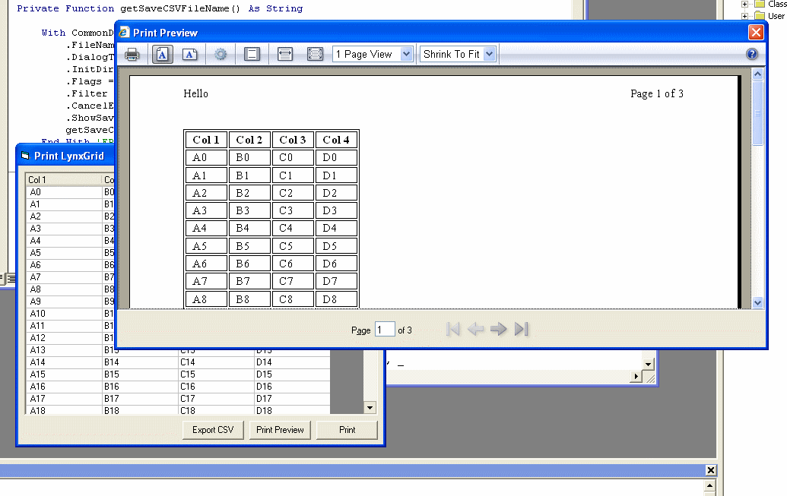



## Print and Export To CSV for LynxGrid

### Description

This includes a class to Print and Export Richard Mewett's LynxGrid control using the browser controls print preview.

'printing portions modified from Hawke's "Print preview using xml"

'html generation modified from Eoin Armstrong's "MSFlexgrid to HTML"

'To use with another grid simply modify the GridToArray Procedure
 
### More Info
 

             |
---                |---
**Submitted On**   |2007-05-21 14:07:24
**By**             |[marshalfaulkner](https://github.com/Planet-Source-Code/PSCIndex/blob/master/ByAuthor/marshalfaulkner.md)
**Level**          |Intermediate
**User Rating**    |5.0 (20 globes from 4 users)
**Compatibility**  |VB 6\.0
**Category**       |[Custom Controls/ Forms/  Menus](https://github.com/Planet-Source-Code/PSCIndex/blob/master/ByCategory/custom-controls-forms-menus__1-4.md)
**World**          |[Visual Basic](https://github.com/Planet-Source-Code/PSCIndex/blob/master/ByWorld/visual-basic.md)
**Archive File**   |[Print\_and\_2066795212007\.zip](https://github.com/Planet-Source-Code/marshalfaulkner-print-and-export-to-csv-for-lynxgrid__1-68645/archive/master.zip)

